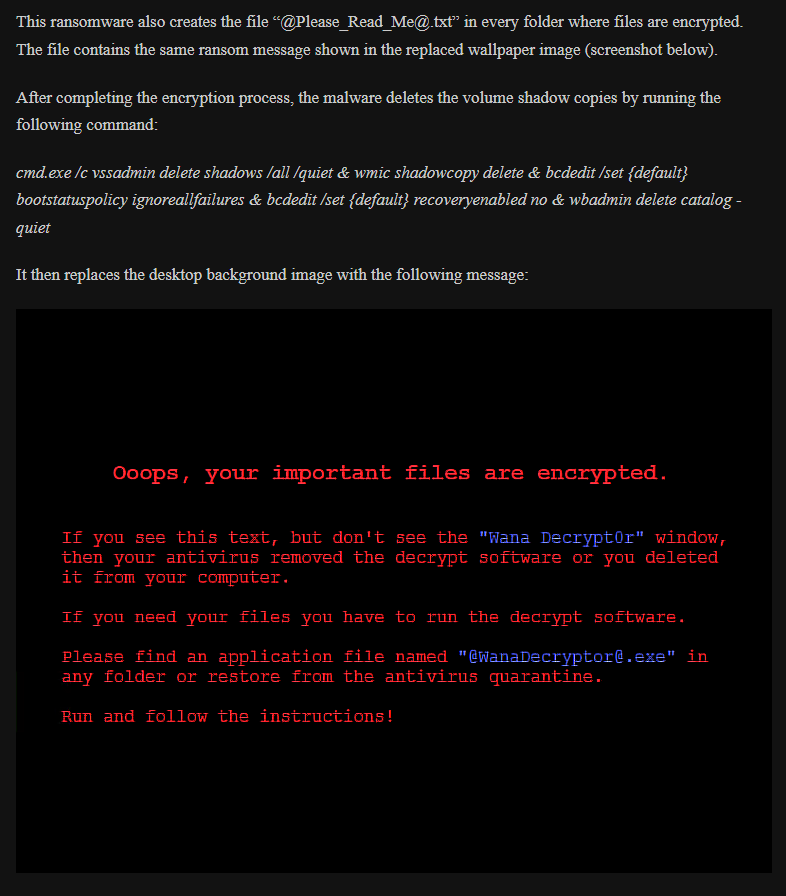

### ~~Generalized Logs~~
- [X] fix backslash and forward slashes
- [X] check if forward slash (/) is from cuckoo 
  - (all / come from 'C:/tmpgto74e/analyzer.py.' which is the py file to run the cuckoo analyzer)
- [X] percentage or avg performance
  - since it's hard to see which would be better

### ~~Document why we are using Generalized ET/SVM for cuckoo logs~~
  - We tested the performance of Normal, Pre-Encrypted, Generalized, and Removed Logs \
and Pre-Encryption Extra Trees work the best for us. 

### ~~[Confirm @Please_Read_Me@.txt](https://medium.com/markdown-monster-blog/getting-images-into-markdown-documents-and-weblog-posts-with-markdown-monster-9ec6f353d8ec)~~ 

### Continue Spam Detection
- help integrate tf-idf across different documents

### ~~Removing Cuckoo files from the cuckoo logs~~

### ~~Probabilities and Threshold~~
- [X] Combine probabilities (avg) to gain a better result
- [X] Compare Probabilities (Log, PCAP, Avg)
- [X] Set a threshold for Infected or Benign

### ~~[Check how the estimators are used in the stacking classifier](https://www.youtube.com/watch?v=xtTyEoJ31Vg)~~
- the way Stacking Classifiers work is that they split the data in to two chunks (training & testing),\
then split the training into buckets and train the estimators and produce Meta Model data \
and use that data to train the final classifier
