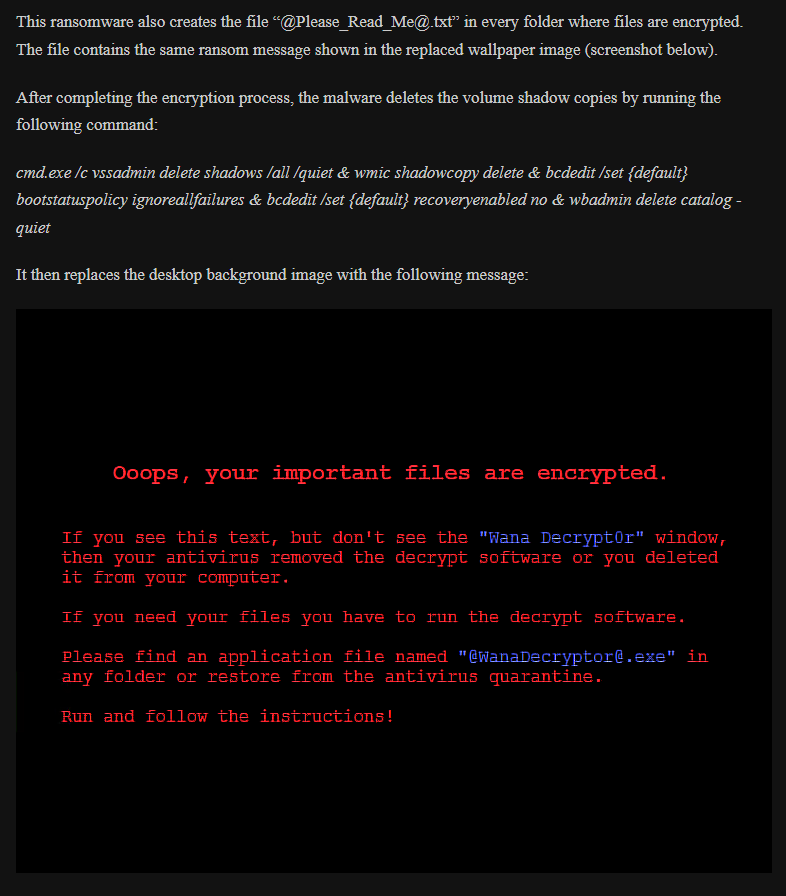

### Generalized Logs
- [X] fix backslash and forward slashes
- [X] check if forward slash (/) is from cuckoo 
  - (all / come from 'C:/tmpgto74e/analyzer.py.' which is the py file to run the cuckoo analyzer)
- [X] percentage or avg performance
  - since it's hard to see which would be better

### Document why we are using Pre-Encryption/Generalized ET for cuckoo logs
  - We tested the performance of Normal, Pre-Encrypted, \
Generalized, and Removed Logs and Pre-Encryption Extra Trees work the best for us. 

### [Confirm @Please_Read_Me@.txt](https://medium.com/markdown-monster-blog/getting-images-into-markdown-documents-and-weblog-posts-with-markdown-monster-9ec6f353d8ec) 

### Continue Spam Detection
- help integrate tf-idf across different documents
   
- How TF-IDF works, with a set of documents (i.e. Infected/Benign Logs), we turn the paths \
into features and count how many times the feature was in that one document. This is the term \
frequency (TF). The problem with this is that it treats common irrelevant features equal to the \ 
relevant features. To get around this, we use Inverse Document Frequency (IDF), this \
helped us remove or lower the common irrelevant features. \
IDF = Log(# of times feature was in a document/total documents). What this means is that the more times \
a feature is found in a document the closer the value becomes zero, thus removing commonality.
   
- how spam detection worked is how I used to do it, where each log or "email" is given their own tf-idf \
whereas in Dr. Chen's paper she gathered tf-df of a set of logs/"emails". i.e. with my set of logs \
I had 30 rows of tf-idf, but I can combine a set of logs, like (two benign/two infected) which \
would give me 15 rows of tf-idf. They have to have the same target otherwise we cannot combine.
   
- References
  - https://www.youtube.com/watch?v=hc3DCn8viWs&list=LL&index=2

### Removing Cuckoo files from the cuckoo logs

### Probabilities and Threshold
- [X] Combine probabilities (avg) to gain a better result
- [X] Compare Probabilities (Log, PCAP, Avg)
- [X] Set a threshold for Infected or Benign

### [Check how the estimators are used in the stacking classifier](https://www.youtube.com/watch?v=xtTyEoJ31Vg)
- the way Stacking Classifiers work is that they split the data in to two chunks (training & testing),\
then split the training into buckets and train the estimators and produce Meta Model data \
and use that data to train the final classifier
